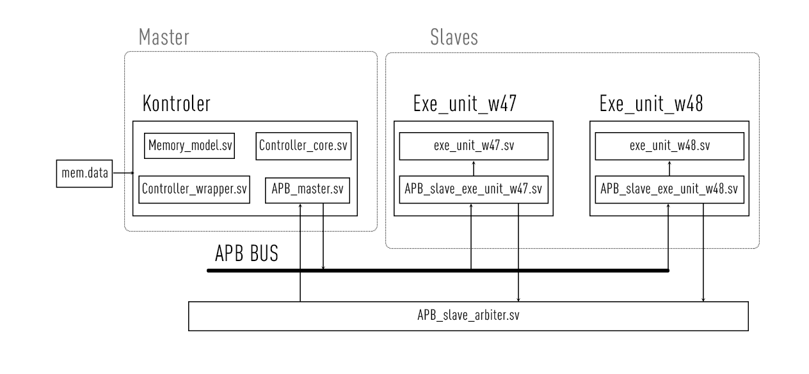

# Komunikacja magistralą APB z układami Exe_unit_w47 oraz Exe_unit_w48

## Opis

Przedstawiony naszym zespołem badawczym projekt jest złożonym układem logicznym zawierającym w sobie dwie raniej sprojektowane jednostki wykonawcze oraz kontroller który współdziała i komunikuje z nimi za pomocą magistrali **APB** realizowanej przez tak zwany **APB_BUS**  

Zaprojektowany układ można przedstawić w postaci:

## Slave-y

Jednostki wykonawcze **Exe_unit_w47** oraz **Exe_unit_w48** do prawidłowego współdziałania z slave arbiterem zostali dodatkowo opisane za pomocą modółów **APB_slave**. Każdy taki blok funkcyjny posiada wejścia i wyjścia zgodnie z interfejsem AMBA APB:

| Wejścia     |    Szerokość  |      Funkcja    |
| ----------- |:-------------:|:---------------:|
| i_PCLK      | binarne       | wejście zegara  |
| i_PRESETn   | binarne       | reset           |
| i_PADRR     | **16**-bitowe | adress slave-a  |
| i_PSEL      | binarne       | sygnał wyboru   |
| i_PENABLE   | binarne       | gotowność slave-a na odbiór danych|
| i_PWRITE    | binarne       | tryb zapisu/odczytu    |
| i_PWDATA    | **8**-bitowe  | dane do odebrania  |

| Wyjścia     |    Szerokość  |      Funkcja    |
| ----------- |:-------------:|:---------------:|
| o_PREADY    | binarne       | gotowność slave-a na wysłanie danych |
| o_PRDATA    | **8**-bitowe  | dane do wysłania |
| o_PSLVERR   | binarne       | sygnał błądu  |

Możemy zmieniać szerokość bitową **i_PADRR**, **i_PWDATA** oraz **o_PRDATA**  poniważ ona jest zadana za pomocą parametrów. Tę parametry są wyznaczanę w pliku *parameters.vh*. Interfejs AMBA APB uwzględnia pracę z szerokościami tych wejść/wyjść do 32-bitów.

## Master-kontroler

Kontoler pozwala na pracę z jednostkami wykonawczymi przez komunikację z nimi oraz jest głównym sterownikiem naszego układu. Kontroler przyjmuje zadane przez użytkownika dane i po otrzymaniu wyników z powrotem oddaje użytkowniku. *De-facto* posiada dwa interfejsy: do pracy z użytkownikiem oraz APB. 

Kontroler jest przedstawiony kilkoma plikami naraz: 

* APB_master.sv

    Kontroluje zachowanie się **APB_BUS**u

* Controller_core.sv

    Główne jądro, serce kontrolera 

* Controller_wrapper.sv

    Pozwala na prace pozostałych elementów kontrolera łącząc ich w jedność 

* Memory_model.sv

    Odpowiada za pamięć kontrolera, traktuje i opisuje instrukcji z zewnątrz

I jeszce potrzebuje plik simulający pamięć - *mem.data* 

Kontroler używa własny rodzaj instrukcyj niezbędnych do pracy z rejestrami. Taki zestaw się  znajduje w *mem.data*. Kontroler posiada cztery polecenia, czego jest wystarcająco do poprawnego działania całego układu:

| Instrukcja |    Funkcja    |     Dodatkowe polecenie    |
| -----------|:-------------:|:---------------:|
|  0000      |  Wstrzymaj o jedyn takt zegara    | -  |
|  0001      |  Przenieść wartość z rejestra na rejestr      | Adres Skąd, adres Dokąd           |
|  0002      |  Wgraj do panięci (emulowanej) | -  |
|  FFFF      |  Koniec pracy, analog HLT x86    | -   |

Wszystkie polecenia poza **0001** wywolane są "jedną linijką", wowczas gdy **0001** potrzebuje jeszcze trzy linijki z dodatkowymi danymi, syntaksys jest opisany w taki sposób że odrazu po wywołaniu polecenie jest adres skąd mamy wząć wartość, po tym jest adres dokąd mamy ją przenieść. Z tego powodu że to polecenie realizuje zapis zarówno jak odczyt, istnieje czwarta linijka która ma wartość niezerową tylko w trybie zapisu. Przykładowo:  

| Instrukcja |    Opis    |
| -----------|:----------------------------:|
|  0001      |  Przenieść wartość    |
|  0000      |  Z adresu rejestru 0000 (nikąd)                |
|  FF02      |  Do adresu rejestru slave-a __1__  |
|  0001      |  Wartość 0001   |

W naszej impilementacji zostało jednogłośnie przyjęte że adresy slave-ów zaczynają się od <u>FF<u>.